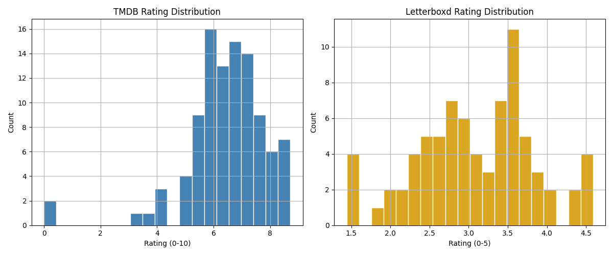
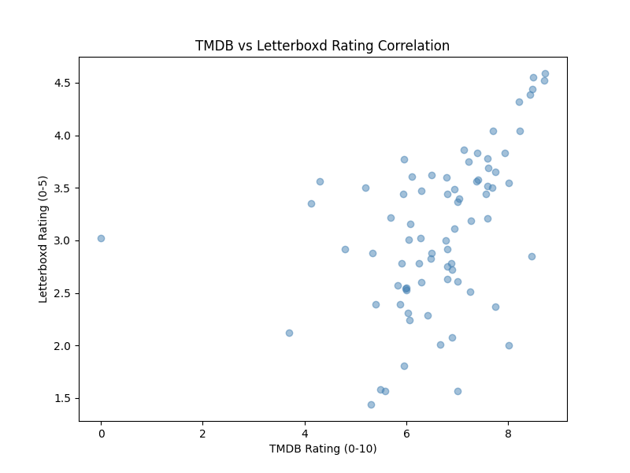
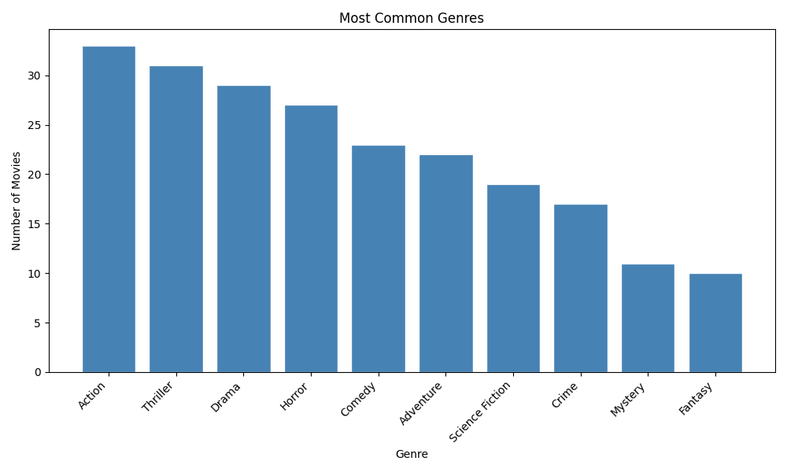
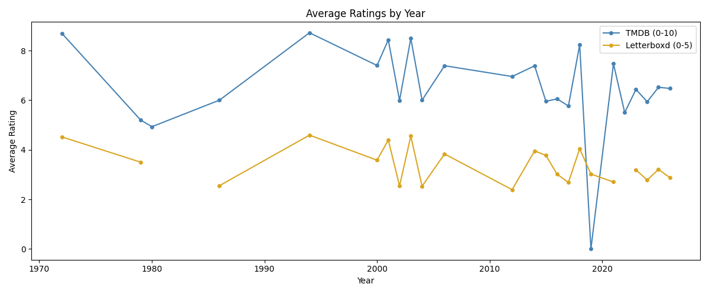

# REPORT.md

## 1. Data Collection Summary

**Sources:** The Movie Database (TMDB) API and Letterboxd (web scraping).

**TMDB API:** Collected 50 movies from the `/movie/popular` endpoint (paginated). For each movie, full details (`/movie/{id}`) and cast/crew (`/movie/{id}/credits`) were fetched, resulting in a JSON with the title, release date, runtime, genres, budget, revenue, TMDB rating, vote count, director, and top cast for each movie.

**Letterboxd scraping:** For each of the 50 TMDB titles, the corresponding Letterboxd film page was scraped using a slug derived from the movie title to obtain average rating (0–5 stars) and fan count of each movie. Scraping was rate-limited to 2 seconds per request and verified against `robots.txt` before any requests were made.

**Processed dataset:** 50 movies with 17 fields, merged on title and release year, saved to `data/processed/`.

---

## 2. Analysis Findings

### Rating Analysis

| Metric | TMDB (0–10) | Letterboxd (0–5) |
|---|---|---|
| Mean | 6.468 | 3.088 |
| Std dev | 1.449 | 0.746 |

The correlation of **r = 0.434**, which reveals a moderate, positive linear relationship between the TMDB and Letterboxd ratings. This means that high TMDB ratings are associated with high Letterboxd ratings. However, the strength of this association is moderate, indicating that there is a difference in how movies are rating between TMDB and Letterboxd.

### Genre Analysis

| Rank | Genre | Count |
|---|---|---|
| 1 | Action | 33 |
| 2 | Thriller | 31 |
| 3 | Drama | 29 |
| 4 | Horror | 27 |
| 5 | Comedy | 23 |

- Highest rated by TMDB avg: **Music** (7.471)
- Highest rated by Letterboxd avg: **Fantasy** (3.604)

### Temporal Analysis

- Most movies released in: **2026** (expected, as data was pulled from the current popular list)
- Highest-rated year on both platforms: **1994** (with TMDB average of 8.719 and Letterboxd average of 4.59)

---

## 3. Interesting Insights

**The moderate correlation potentially reflects platform demographics.** The strength of the association between TMDB and Letterboxd ratings is moderate (r = 0.434), which could indicate different demographics between the platforms. For example, it is likely that TMDB has a broad, casual audience, which Letterboxd have raters who rate more critically. Usually, a moderate correlation could indicate significant variability in the data, but both platforms have nearly identical relative spread (coefficient of variation is ~14.5–15%), which means that the platform demographics just differ in taste and not in rating behavior.

**Genre frequency and quality are inversely related.** The Action genre has the highest count (33 movies) but are not highly rated on average for both platforms. The genres that rate highest are the Music genre on TMDB and the Fantasy genre on Letterboxd. However, this may be the cause because they are more niche and audiences that are already interested may be the only watchers, which could therefore inflate the average scores for these genres. In contrast, popular movie genres target a broader audience and may include more polarized ratings.

**1994 is an unexpected outlier.** Pulling from `/movie/popular` should bias heavily toward recent releases, but many 1994 classics had high ratings and were popular, which could be caused by re-release streams or anniversary events. This is surprising because it may be unexpected for older movies to be relevant, but this confirms that "popular now" and "released recently" are not equivalent.

---

## 4. Challenges and Solutions

**Letterboxd slug mismatch:** Letterboxd URL slugs don't always match a simple lowercased, punctuation-stripped title (e.g. disambiguation suffixes like `-2024`). Solved by constructing slugs with a regex-based `_slugify_title()` method that strips punctuation and replaces spaces with hyphens, which covers the majority of cases.

**TMDB budget/revenue zeros:** TMDB returns `0` rather than `null` when financial data is unavailable. These were replaced with `None` in `data_processor.py` to avoid treating undisclosed budgets as $0 productions.

**Merge key reliability:** TMDB and Letterboxd may store slightly different titles for the same film. Merging on `title + release_year` rather than a shared ID means any title discrepancy causes a missed join. Accepting `NaN` Letterboxd fields for unmatched rows (left join) avoids data loss while flagging the gap.

---

## 5. Limitations and Future Improvements

**Limitations:**
- Dataset is limited to 50 movies from a single popularity snapshot, which is non-random and may not be a representative or longitudinal sample.
- Fan counts on Letterboxd may not exist for newer titles.
- Budget and revenue fields are missing for most movies, limiting financial analysis.
- Temporal analysis is shallow with one dominant year (2026) and sparse historical coverage.

**Future improvements:**
- Implement other movie data sources for richer analysis.
- Expand collection across multiple TMDB endpoints (`/movie/top_rated`, `/movie/upcoming`) and paginate deeper to get a more balanced sample.
- Add a longitudinal dimension by re-running the pipeline periodically and tracking how ratings evolve as vote counts grow.
- Incorporate TMDB's `/discover` endpoint to filter by genre or year, enabling controlled comparisons rather than popularity-biased samples.